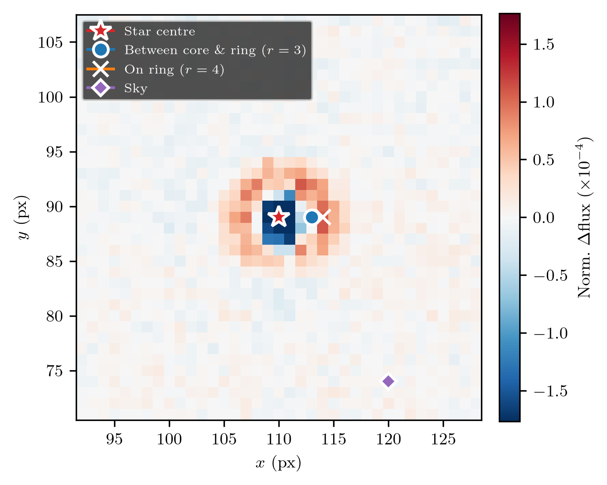
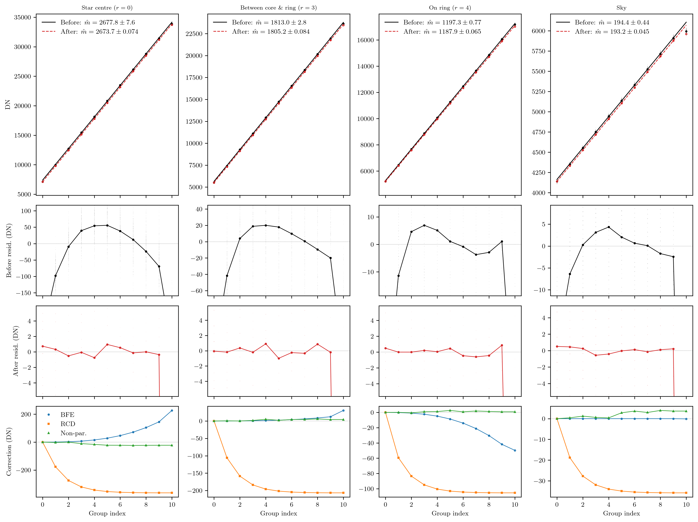

# rampdoctor

[](https://github.com/CheerfulUser/rampdoctor/actions/workflows/tests.yml)
[](LICENSE)
[](https://www.python.org)

`rampdoctor` corrects two detector systematics in JWST up-the-ramp data at
the group level, before ramp fitting. The **brighter-fatter effect (BFE)**
redistributes charge from bright pixels into their neighbours as the wells
fill, broadening the PSF over the course of an integration and biasing
aperture photometry built from group differences. **Reset charge decay
(RCD)** adds an exponentially decaying signal to the first few groups after
each detector reset, imprinting a common ramp-shaped systematic on every
integration.

Both effects are fit directly from the science data — no reference files are
required. The BFE amplitude and threshold are fit from the brighter-fatter
signature of the brightest source in the field; the decay timescale is fit
from background pixels. On JWST MIRI time-series observations the joint
correction reduces group-level lightcurve RMS by 3–10×.

The package operates pimarily on pipeline-processed (`ramp`) SCI
cubes of shape `(n_int, n_groups, ny, nx)`. It is developed and validated on
MIRI but the approach applies to any instrument with non-destructive
up-the-ramp sampling.

## Installation

```bash
pip install -e .
```

## Quick start

```python
from rampdoctor.ramp_correction import correct_bfe_rcd

# Pipeline-processed (ramp.fits) data — linearity already applied
cube_cor = correct_bfe_rcd(cube, fit_bfe=True, verbose=True)
```

Pass `diagnostics=True` and a `save_path` to produce diagnostic figures
(PSF-difference fit quality, migration model residual, pixel ramp profiles,
and background gradient profiles at each correction stage).

Or use the object-oriented interface:

```python
from rampdoctor import RampDoctor

rd = RampDoctor(file='jw_mirimage_ramp.fits', verbose=True)
rd.fit_bfe()
cube_cor = rd.correct()
rd.save('corrected.fits')
```

## Method

The correction applies two sequential steps to the group-to-group gradients:

**Step 1 — BFE inversion (charge-migration model)**

Each group difference is modelled as a true flux gradient that has been
redistributed by charge migration between readouts:

```
Q_g = _mig_group(Q_{g-1} + dQ_true, M, threshold)
obs_g = Q_g - Q_{g-1}
```

`_mig_group` shifts a fraction of the charge in each pixel into its
cardinal neighbours proportional to `M × max(Q − threshold, 0)`.
Migration-free gradients are recovered from the median ramp by Born
iteration. The per-integration correction is the difference between
the recovered true gradient and the observed median gradient, applied
uniformly across integrations. Calibrated defaults (`M = 4.2×10⁻⁷`,
`threshold = 37.2 DN`) are derived from fits to linearised MIRI ramp
data across two targets.

**Step 2 — RCD subtraction**

The global decay timescale `tau` is fitted from background pixels (groups
≥ 1). Per-pixel amplitude `A_crd`, flat rate, and first-frame offset are
then fitted via linear least squares. The decay `A_crd · exp(−g/τ)` is
subtracted from every gradient of every integration.

**Optional: BFE parameter fitting**

When `fit_bfe=True`, `fit_migration_params` detects the brightest source via
SEP and fits `M` and `threshold` by minimising the residual between the
observed and modelled late−early PSF difference image. An iterative RCD
re-fit prevents the decay and migration parameters from absorbing each other.

## Validation

| Target | Data | M (fit) | Threshold | RMS before | RMS after | Improvement |
|---|---|---|---|---|---|---|
| Wolf 359 | ramp.fits | 4.32×10⁻⁷ | 37.8 DN | 1.03% | 0.21% | 4.9× |
| TRAPPIST-1 | ramp.fits | 4.09×10⁻⁷ | 36.6 DN | 0.80% | 0.22% | 3.6× |
| EV Lac | ramp.fits | 2.40×10⁻⁷ | 74.9 DN | 0.65% | 0.16% | 4.1× |

The consistent `M` and threshold across two independent MIRI targets
(observed in different modes) support their use as instrument-level
defaults. 

## Example diagnostics

Migration model fit on EV Lac (MIRI SUB256, ramp.fits): observed
late−early PSF difference, best-fit migration model, residual, and
radial profile.


Pixel locations selected for ramp diagnostics (star, background, and
reference pixels).



Per-pixel ramp profiles before and after each correction stage.



## Tests

```bash
pip install -e .[test]
pytest tests/
```
